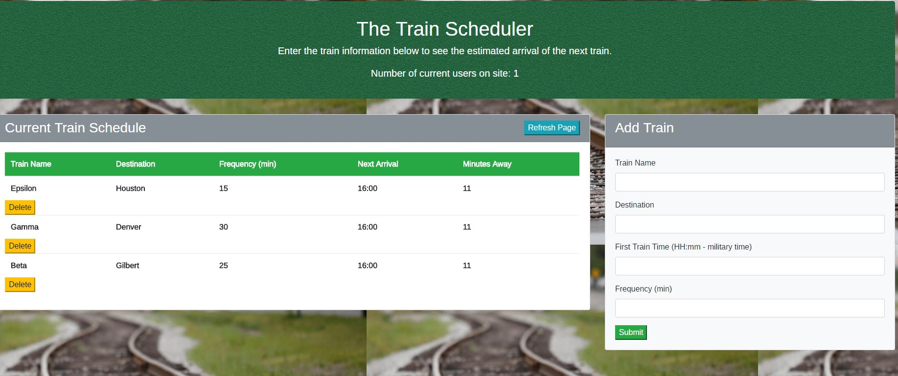

# Train-Scheduler

## Overview

A basic train schedule application that incorporates Firebase to host arrival and departure data. Site retrieves and manipulates this information with Moment.js. You can add trains to firebase through website and it will show their arrival times and how many minutes remain until they arrive at their station.

## Authors

* **Bethany Pfeister** 

## Acknowledgments

* UA Programming Bootcamp